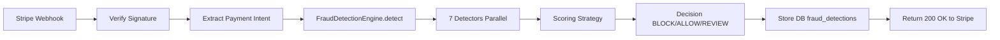

# Epic 1: Stripe Integration & Detection API

**Status**: 📋 Ready for Development  
**Timeline**: Sprint 1-2 (Week 2-3, 10 jours ouvrés)  
**Stories**: 7 stories  
**Story Points**: ~39 points (estimation)

---

## Epic Goal

Établir l'intégration Stripe bout-en-bout avec OAuth, webhooks robustes, pipeline de détection modulaire (7 detectors), trust score system, et custom rules engine. À l'issue de cet epic, chaque payment intent Stripe déclenche automatiquement une analyse fraud, résultat stocké en DB avec decision (BLOCK/ALLOW/REVIEW) et accessible via API.

---

## Success Criteria

- ✅ Merchant peut connecter Stripe account via OAuth one-click
- ✅ Webhooks `payment_intent.created` déclenchent détection automatique
- ✅ 7 fraud detectors exécutent en parallèle (<350ms P95)
- ✅ Trust score system track comportement clients
- ✅ Custom rules engine permet configuration merchant-specific
- ✅ API detection retourne decision (BLOCK/ALLOW/REVIEW) avec confidence
- ✅ Résultats stockés en DB avec traçabilité complète

---

## Stories

### Story 1.1: Stripe OAuth Connection Flow
**Description**: Merchant connecte Stripe account via OAuth avec scope read-only payments  
**Story Points**: 5  
**Status**: 📋 Ready

### Story 1.2: Stripe Webhook Configuration & Handler
**Description**: Système reçoit et vérifie webhooks `payment_intent.created` pour trigger détection  
**Story Points**: 5  
**Status**: 📋 Ready

### Story 1.3: Fraud Detection API Endpoint
**Description**: Endpoint unifié orchestrant tous detectors et retournant decision finale  
**Story Points**: 8  
**Status**: 📋 Ready

### Story 1.4: Velocity Detector
**Description**: Détection transactions par timeframe (card testing attacks)  
**Story Points**: 5  
**Status**: 📋 Ready

### Story 1.5: Geolocation Detector
**Description**: Détection mismatch IP country vs card billing country  
**Story Points**: 5  
**Status**: 📋 Ready

### Story 1.6: Trust Score System & Detector
**Description**: Système de trust scores basé sur comportement historique client  
**Story Points**: 8  
**Status**: 📋 Ready

### Story 1.7: Custom Rules Engine
**Description**: Merchant définit règles custom (thresholds, conditions, actions)  
**Story Points**: 8  
**Status**: 📋 Ready

---

## Technical Dependencies

### Pre-Requisites
- ✅ Monorepo Turborepo configuré (POC validé)
- ✅ `@orylo/fraud-engine` package créé avec interfaces
- ✅ `@orylo/database` package avec schémas Drizzle
- ✅ Better Auth configuré avec Organizations plugin
- ✅ PostgreSQL (Neon) + Redis (Upstash) provisionnés

### External Services
- 🔧 Stripe OAuth app créé (client_id, secret)
- 🔧 Stripe webhooks endpoint configuré (dev mode)
- 🔧 MaxMind GeoIP2 database téléchargée (self-hosted)

### Infrastructure
- 🔧 Environment variables configurées (`.env.local`)
- 🔧 Database migrations exécutées (Drizzle)
- 🔧 Redis connection testée

---

## Architecture Notes

### Detection Pipeline Flow



### Detector Interface

```typescript
interface IDetector {
  readonly id: DetectorId;
  readonly name: string;
  readonly description: string;
  readonly severity: number; // 0-100 base score

  init?(): Promise<void>;
  execute(context: FraudDetectionContext): Promise<FraudDetectionResult | null>;
}
```

### Database Schema

**Tables**:
- `organizations` (Better Auth Organizations plugin)
- `fraud_detections` (detection results)
- `customer_trust_scores` (trust score tracking)
- `custom_rules` (merchant-defined rules)

---

## Performance Requirements

| Metric | Target | Critical? |
|--------|--------|-----------|
| **Webhook Response Time** | <2s (Stripe 30s timeout) | ✅ Yes |
| **Detection P95 Latency** | <350ms | ✅ Yes |
| **Individual Detector** | <100ms each | ⚠️ Nice-to-have |
| **Redis Cache Hit Rate** | >80% | ⚠️ Nice-to-have |
| **Database Query Time** | <50ms per query | ⚠️ Nice-to-have |

---

## Testing Strategy

### Unit Tests (≥80% coverage)
- `@orylo/fraud-engine` package
- Individual detectors logic
- Scoring strategy calculations
- Custom rules evaluation engine

### Integration Tests (≥60% coverage)
- Stripe webhook signature verification
- Detection API endpoint
- Database CRUD operations
- Redis caching logic

### E2E Tests (Story 3.7)
- Complete webhook → detection → storage flow
- Stripe CLI `stripe trigger payment_intent.created`

---

## Risk Management

### High Priority Risks

**Risk 1**: Detection latency >350ms P95
- **Mitigation**: Parallel detector execution, Redis caching, query optimization
- **Contingency**: Adjust threshold to 500ms, optimize post-MVP

**Risk 2**: Stripe OAuth complexity
- **Mitigation**: Follow Stripe Express OAuth pattern (well-documented)
- **Contingency**: Fallback to manual API key for beta

**Risk 3**: False positive rate too high (>10%)
- **Mitigation**: Tune detector thresholds during beta
- **Contingency**: Add "Review" queue instead of auto-block

**Risk 4**: Custom rules syntax too complex
- **Mitigation**: Start simple (single condition), iterate based on feedback
- **Contingency**: Defer advanced rules (AND/OR) to post-MVP

---

## Definition of Done (Epic Level)

- [ ] All 7 stories completed with AC met
- [ ] Unit tests pass (≥80% coverage fraud-engine)
- [ ] Integration tests pass (≥60% coverage API)
- [ ] E2E test: Webhook triggers detection, result in DB
- [ ] Performance validated: P95 <350ms
- [ ] Stripe OAuth tested with real account
- [ ] Documentation updated (API routes, detectors)
- [ ] Code reviewed and merged to main
- [ ] Deployed to dev environment

---

## Next Epic

**Epic 2**: Dashboard Action-First Experience (Sprint 3-4)  
Depends on: Epic 1 completion (detection API functional)

---

**Created**: 2026-01-13  
**Owner**: Product Owner (Sarah)  
**Last Updated**: 2026-01-13
