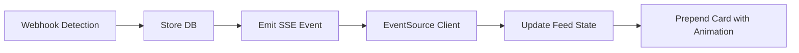

# Epic 2: Dashboard Action-First Experience

**Status**: 📋 Ready for Development  
**Timeline**: Sprint 3-4 (Week 4-5, 10 jours ouvrés)  
**Stories**: 12 stories  
**Story Points**: ~48 points (estimation)

---

## Epic Goal

Créer le dashboard action-first avec feed real-time de détections, stats contextuelles, filtres pratiques, actions one-click (block/whitelist), Server-Sent Events pour mises à jour live, et version mobile responsive avec Sheet navigation. À l'issue de cet epic, le merchant peut surveiller et agir sur la fraude sans quitter le dashboard.

---

## Success Criteria

- ✅ Dashboard affiche feed détections avec key info (email, amount, decision, score)
- ✅ Stats cards contextuelles (total transactions, blocked, at risk, saved €)
- ✅ Filtres pratiques (decision, date range) avec URL state
- ✅ Actions one-click: Block et Whitelist avec confirmation
- ✅ Detection Details Dialog affiche infos complètes (detectors, trust score)
- ✅ SSE real-time: Nouvelles détections apparaissent instantanément
- ✅ Mobile responsive (375px): Sheet navigation, full-width cards
- ✅ Dark mode support via system preference
- ✅ Accessibility: Keyboard navigation, ARIA labels, WCAG AA

---

## Stories

### Story 2.1: Feed Dashboard avec Detection Cards
**Description**: Feed vertical de detection cards avec key info at a glance  
**Story Points**: 5  
**Status**: 📋 Ready

### Story 2.2: Stats Cards (Contextual Metrics)
**Description**: Key metrics dashboard (Total Transactions, Blocked, At Risk, Saved €)  
**Story Points**: 3  
**Status**: 📋 Ready

### Story 2.3: Filters (Decision, Date Range)
**Description**: Filter detections par decision type ou date range  
**Story Points**: 3  
**Status**: 📋 Ready

### Story 2.4: Detection Details Dialog
**Description**: Modal affichant full detection details (detectors, trust score)  
**Story Points**: 5  
**Status**: 📋 Ready

### Story 2.5: Search & Sort
**Description**: ⚠️ DEFERRED to post-MVP (protect timeline)  
**Story Points**: -  
**Status**: 🚫 Descoped

### Story 2.6: Mobile Navigation with Sheet
**Description**: Hamburger menu Sheet pour navigation mobile  
**Story Points**: 3  
**Status**: 📋 Ready

### Story 2.7: Block Customer Action
**Description**: One-click block customer avec confirmation AlertDialog  
**Story Points**: 5  
**Status**: 📋 Ready

### Story 2.8: Whitelist Customer Action
**Description**: One-click whitelist trusted customer avec undo option  
**Story Points**: 5  
**Status**: 📋 Ready

### Story 2.9: Quick Actions Menu (3-dot)
**Description**: Secondary actions menu (Popover) pour UI propre  
**Story Points**: 2  
**Status**: 📋 Ready

### Story 2.10: Server-Sent Events (SSE) Real-Time Updates
**Description**: New detections appear instantly via SSE stream  
**Story Points**: 8  
**Status**: 📋 Ready

### Story 2.11: Mobile Responsive Design
**Description**: Dashboard fully usable on mobile (375px viewport)  
**Story Points**: 5  
**Status**: 📋 Ready

### Story 2.12: Dark Mode Support (System Preference)
**Description**: Dark mode based on system preference  
**Story Points**: 2  
**Status**: 📋 Ready

---

## Technical Dependencies

### Pre-Requisites
- ✅ Epic 1 completed (Detection API functional)
- ✅ Shadcn UI components installed (34/51 used)
- ✅ `globals.css` oklch colors configured
- ✅ Next.js App Router configured
- ✅ Better Auth session management working

### UI Components Required
- ✅ Card, Badge, Button, Select, Separator, Skeleton, Spinner (installed)
- ✅ Tooltip, ScrollArea, Avatar, Kbd (installed)
- ✅ AlertDialog, Dialog, Sheet, Popover (installed)
- ✅ Label, Checkbox, Switch, Sonner (Toast) (installed)
- ✅ Tabs, Progress, Slider, Calendar, Combobox (installed)
- 🔧 Badge variant "warning" (needs to be added for REVIEW decision)

### API Endpoints Required
- `GET /api/detections` (list with filters, pagination)
- `GET /api/detections/stats` (aggregated metrics)
- `POST /api/customers/[id]/block`
- `POST /api/customers/[id]/whitelist`
- `GET /api/events` (SSE stream)

---

## Architecture Notes

### Component Structure

```
app/dashboard/
├── page.tsx (Server Component - SSR)
├── feed-client.tsx (Client Component - SSE)
├── stats-panel.tsx (Server Component)
├── filters.tsx (Client Component)
└── components/
    ├── detection-card.tsx
    ├── detection-dialog.tsx
    ├── block-alert-dialog.tsx
    ├── stats-card.tsx
    └── mobile-sheet.tsx
```

### SSE Flow



### Shadcn Component Mapping

| Screen Element | Shadcn Component |
|----------------|------------------|
| Detection Card | `Card` + `Card.Header` + `Card.Content` + `Card.Footer` |
| Decision Badge | `Badge` (destructive/warning/success) |
| Actions | `Button` (destructive/secondary) |
| Filters | `Select` + `Calendar` |
| Loading | `Skeleton` + `Spinner` |
| Details Modal | `Dialog` (desktop) or full-screen (mobile) |
| Block Confirm | `AlertDialog` |
| Mobile Nav | `Sheet` (slide from left) |
| Quick Actions | `Popover` |
| Feedback | `Sonner` (Toast) |

---

## Design System

### Colors (oklch from `globals.css`)

**Existing**:
- `--background`, `--foreground`, `--card`, `--primary`, `--secondary`
- `--destructive` (BLOCK decision)
- `--success` (ALLOW decision)
- `--muted`, `--accent`, `--border`, `--ring`

**To Add** (Story 2.1 AC6):
```css
:root {
  --warning: oklch(0.834 0.154 89.52); /* Yellow-500 for REVIEW */
  --warning-foreground: oklch(0.147 0.004 49.25);
}
```

### Responsive Breakpoints

| Device | Width | Layout |
|--------|-------|--------|
| Mobile | 375px-767px | Sheet nav, 1 col feed, 2x2 stats grid |
| Tablet | 768px-1023px | Sidebar nav, 1 col feed, 1x4 stats row |
| Desktop | 1024px+ | Sidebar nav, centered feed (720px), 1x4 stats |

---

## Performance Requirements

| Metric | Target | Critical? |
|--------|--------|-----------|
| **Dashboard Load (LCP)** | <2s | ✅ Yes |
| **Feed Render (20 items)** | <500ms | ✅ Yes |
| **SSE Connection Latency** | <1s | ✅ Yes |
| **Action Feedback (Toast)** | <100ms (optimistic UI) | ⚠️ Nice-to-have |
| **Dialog Open** | <200ms | ⚠️ Nice-to-have |

---

## Testing Strategy

### Component Tests
- Detection card rendering (all variants)
- Stats cards calculation
- Filters state management
- Dialog interactions

### Integration Tests
- API route handlers
- SSE event stream
- Action endpoints (block/whitelist)

### E2E Tests (Story 3.7)
- Login → Dashboard happy path
- Block customer flow
- SSE real-time update
- Mobile responsive (375px viewport)
- Filters functionality

---

## Accessibility Requirements

### WCAG 2.1 Level AA Compliance

**Keyboard Navigation**:
- Tab order logical (feed → filters → actions)
- Escape closes dialogs/sheets
- Enter/Space activate buttons

**ARIA Labels**:
- All interactive elements labeled
- Dialog has `role="dialog"`, `aria-labelledby`
- Buttons have descriptive labels

**Color Contrast**:
- All text ≥4.5:1 contrast ratio
- Badge colors validated (destructive/warning/success)

**Touch Targets** (Mobile):
- All buttons ≥44x44px
- Card tap area entire card surface

---

## Risk Management

### High Priority Risks

**Risk 1**: SSE implementation complexity
- **Mitigation**: Use Next.js Route Handlers, EventSource API (standard)
- **Contingency**: Fallback to polling (every 10s) if SSE unreliable

**Risk 2**: Mobile UX too cramped
- **Mitigation**: Full-width cards, progressive disclosure (details in dialog)
- **Contingency**: Defer some mobile features (filters) to post-MVP

**Risk 3**: Animation jank (SSE slide-in)
- **Mitigation**: Use CSS transforms (GPU-accelerated), test on real devices
- **Contingency**: Disable animations on `prefers-reduced-motion`

**Risk 4**: Shadcn component customization needed
- **Mitigation**: Most components used as-is, only Badge variant "warning" added
- **Contingency**: Fork component if needed (rare)

---

## Definition of Done (Epic Level)

- [ ] All 12 stories completed with AC met (Story 2.5 descoped)
- [ ] Component tests pass (Jest + React Testing Library)
- [ ] Integration tests pass (API routes)
- [ ] E2E tests pass (5 critical paths)
- [ ] Lighthouse Performance ≥85%, Accessibility ≥95%
- [ ] Mobile tested: iOS Safari + Android Chrome
- [ ] Dark mode verified (light + dark themes)
- [ ] Code reviewed and merged to main
- [ ] Deployed to dev environment

---

## Next Epic

**Epic 3**: Integration & Production Readiness (Sprint 5)  
Depends on: Epic 2 completion (Dashboard functional)

---

**Created**: 2026-01-13  
**Owner**: Product Owner (Sarah)  
**Last Updated**: 2026-01-13
