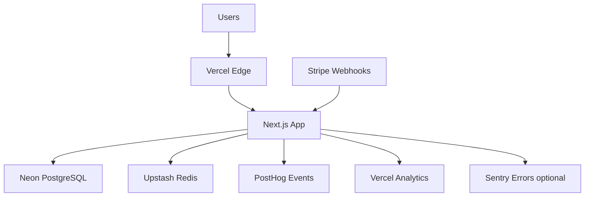

# Epic 3: Integration & Production Readiness

**Status**: 📋 Ready for Development  
**Timeline**: Sprint 5 (Week 6, 5 jours ouvrés)  
**Stories**: 10 stories  
**Story Points**: ~40 points (estimation)

---

## Epic Goal

Finaliser l'intégration Stripe en production avec webhooks robustes (idempotency, retry logic, error handling), implémenter la mise à jour automatique des Trust Scores lors de chargebacks confirmés, établir la stack complète d'observability (logging, monitoring, alerting), et exécuter les tests end-to-end critiques validant les user journeys complets. L'epic inclut également l'optimisation des performances (latency <350ms P95, dashboard <2s load), la préparation du programme beta (documentation, Discord support, onboarding guide), et le déploiement production-ready sur Vercel avec toutes les configurations de sécurité et compliance (GDPR, PCI). À l'issue de cet epic, Orylo est prêt pour accueillir 15 beta users avec une solution stable, performante, et observable.

---

## Success Criteria

- ✅ Production webhooks robustes: idempotency, retry logic, error handling
- ✅ Trust scores auto-update sur chargebacks (webhook `charge.dispute.created`)
- ✅ Observability complète: logging (tslog), monitoring (Vercel Analytics), tracking (PostHog)
- ✅ Performance optimisée: P95 <350ms detection, Dashboard <2s load
- ✅ Security & Compliance: GDPR (90-day retention), PCI (no card data)
- ✅ Testing complet: Integration tests ≥60%, E2E tests 5 critical paths
- ✅ Beta program ready: Documentation, Discord support, onboarding guide
- ✅ Production deployment: Vercel config, env vars, custom domain
- ✅ Beta launch checklist validated: All systems GO

---

## Stories

### Story 3.1: Production Webhooks avec Idempotency & Retry Logic
**Description**: Webhooks robustes avec deduplication, retry logic, dead letter queue  
**Story Points**: 5  
**Status**: 📋 Ready

### Story 3.2: Trust Score Auto-Update sur Chargebacks
**Description**: `charge.dispute.created` webhook auto-update trust scores (-50 pts)  
**Story Points**: 3  
**Status**: 📋 Ready

### Story 3.3: Observability Stack - Logging, Monitoring, Alerting
**Description**: tslog structured logging, Vercel Analytics, PostHog events, Sentry optional  
**Story Points**: 5  
**Status**: 📋 Ready

### Story 3.4: Performance Optimization (NFR1 <350ms P95)
**Description**: DB optimization, Redis caching, detector parallelization, bundle size  
**Story Points**: 5  
**Status**: 📋 Ready

### Story 3.5: Security & Compliance (GDPR, PCI)
**Description**: Data retention policy, right to deletion, PCI verification, privacy policy  
**Story Points**: 3  
**Status**: 📋 Ready

### Story 3.6: Integration Tests - API & Webhooks
**Description**: Integration tests API routes, webhooks, ≥60% coverage  
**Story Points**: 5  
**Status**: 📋 Ready

### Story 3.7: E2E Tests Critical User Journeys (Playwright)
**Description**: 5 E2E tests: Login, Block flow, SSE update, Mobile, Filters  
**Story Points**: 5  
**Status**: 📋 Ready

### Story 3.8: Beta Program Preparation - Documentation & Support
**Description**: Beta onboarding guide, Discord setup, FAQ, bug templates  
**Story Points**: 3  
**Status**: 📋 Ready

### Story 3.9: Production Deployment Configuration
**Description**: Vercel config, env vars, custom domain, DB/Redis production setup  
**Story Points**: 3  
**Status**: 📋 Ready

### Story 3.10: Beta Launch Checklist & Epic 3 Validation
**Description**: Technical/doc/support checklists, smoke testing, GO/NO-GO decision  
**Story Points**: 3  
**Status**: 📋 Ready

---

## Technical Dependencies

### Pre-Requisites
- ✅ Epic 1 completed (Detection API functional)
- ✅ Epic 2 completed (Dashboard functional)
- ✅ Vercel account provisioned
- ✅ Neon PostgreSQL production tier configured
- ✅ Upstash Redis production tier configured
- ✅ Stripe production account approved

### External Services Setup
- 🔧 Vercel custom domain (orylo.com)
- 🔧 Stripe production webhooks endpoint
- 🔧 PostHog project created
- 🔧 Discord server created (optional Sentry)
- 🔧 Email service (Resend) for alerts

---

## Architecture Notes

### Production Infrastructure



### Webhook Idempotency Strategy

```typescript
// Deduplication via event.id
const existingEvent = await db
  .select()
  .from(webhookEvents)
  .where(eq(webhookEvents.stripeEventId, event.id))
  .limit(1);

if (existingEvent.length > 0) {
  return { status: 'duplicate', processed: false };
}
```

### Observability Stack

**Logging** (tslog):
- Structured JSON logs
- Levels: ERROR, WARN, INFO, DEBUG
- Context: requestId, userId, organizationId

**Monitoring** (Vercel Analytics):
- API route latency (P50, P95, P99)
- Dashboard load time (LCP, FCP, TTI)
- Error rates

**Event Tracking** (PostHog):
- `user_login`, `stripe_connected`, `customer_blocked`
- `detection_created`, `whitelist_applied`
- Funnel analysis: Signup → Connect Stripe → First Detection

**Error Tracking** (Sentry optional):
- Client-side errors
- API route exceptions
- Performance traces

---

## Performance Optimization Strategies

### Database Optimization
- Indexes on `organizationId`, `createdAt`, `decision`
- Query only needed columns (avoid `SELECT *`)
- Connection pooling (Neon native)

### Redis Caching
- Trust scores TTL 1h
- Velocity counters TTL 1h
- Cache invalidation on actions

### Frontend Optimization
- Bundle size <500KB (code splitting)
- Image optimization (Next.js Image, WebP)
- Lazy loading (Dialog content)

### Detector Parallelization
- All 7 detectors run in parallel
- Individual timeout 100ms
- Graceful degradation if detector fails

---

## Testing Strategy

### Integration Tests (≥60% coverage)
- Webhook handlers (valid, duplicate, invalid signature)
- API routes (detections, actions)
- Trust score update flow
- Database operations

### E2E Tests (5 critical paths)
1. **Login → Dashboard**: User logs in, sees detection feed
2. **Block Customer Flow**: Click Block → Confirm → Toast → Badge update
3. **SSE Real-Time**: Trigger webhook → Detection appears instantly
4. **Mobile Responsive**: Test 375px viewport, Sheet navigation
5. **Filters Functionality**: Apply filters, verify results

### Performance Tests
- Lighthouse CI: Performance ≥85%, Accessibility ≥95%
- Load testing: k6 or artillery (10 req/s, P95 <350ms)

---

## Compliance Requirements

### GDPR Compliance

**Data Retention** (NFR8):
- Delete fraud_detections >90 days old (cron job)
- User-triggered deletion via API

**Right to Deletion**:
- `DELETE /api/customers/[id]` endpoint
- Cascade delete: detections, trust scores, custom rules

**Data Export**:
- `GET /api/customers/[id]/export` (JSON format)
- Include: detections, trust scores, actions history

### PCI Compliance

**No Card Data Stored** (NFR9):
- Only Stripe tokens (`payment_intent.id`)
- Card last4 + country (non-sensitive)
- Full card numbers NEVER stored

**HTTPS Only** (NFR7):
- Vercel automatic HTTPS
- HTTP redirects to HTTPS

---

## Beta Program Preparation

### Documentation Deliverables

1. **Beta Onboarding Guide** (`docs/beta-onboarding.md`)
   - Step-by-step signup flow
   - Stripe OAuth connection
   - First detection walkthrough
   - Screenshots + GIFs

2. **FAQ** (`docs/faq.md`)
   - "How does detection work?"
   - "What data do you store?"
   - "How to whitelist a customer?"
   - "Pricing after beta?"

3. **Privacy Policy** (`app/privacy/page.tsx`)
   - Data collection (payment intents, IP)
   - Retention policy (90 days)
   - Right to deletion
   - Cookie policy

### Support Channels

**Discord Server**:
- Channels: #announcements, #general, #bug-reports, #feature-requests
- Onboarding bot with links to docs
- Weekly check-in threads

**Bug Report Template** (`.github/ISSUE_TEMPLATE/bug_report.md`):
- Expected behavior
- Actual behavior
- Steps to reproduce
- Environment (browser, OS)

**Feature Request Template**:
- Use case
- Proposed solution
- Alternative solutions

---

## Production Deployment Checklist

### Vercel Configuration

- [ ] Project created: `orylo-production`
- [ ] Framework: Next.js
- [ ] Root directory: `apps/web`
- [ ] Build command: `bun run build`
- [ ] Output directory: `.next`
- [ ] Install command: `bun install`

### Environment Variables

**Required**:
- `DATABASE_URL` (Neon production connection string)
- `REDIS_URL` (Upstash production URL)
- `BETTER_AUTH_SECRET` (generated via `openssl rand -base64 32`)
- `BETTER_AUTH_URL` (https://orylo.com)
- `STRIPE_CLIENT_ID` (production)
- `STRIPE_SECRET_KEY` (production)
- `STRIPE_WEBHOOK_SECRET` (production)
- `NEXT_PUBLIC_POSTHOG_KEY`
- `NEXT_PUBLIC_POSTHOG_HOST`

**Optional**:
- `SENTRY_DSN` (if budget allows)
- `RESEND_API_KEY` (for email alerts)
- `LOG_LEVEL=info` (production)

### Custom Domain

- [ ] Domain: `orylo.com` configured
- [ ] SSL certificate auto-provisioned (Vercel)
- [ ] DNS records verified (A + CNAME)

### Webhook Configuration

- [ ] Stripe production endpoint: `https://orylo.com/api/webhooks/stripe`
- [ ] Events subscribed: `payment_intent.created`, `charge.dispute.created`
- [ ] Webhook secret copied to env vars

---

## Risk Management

### Critical Risks

**Risk 1**: Production deployment fails
- **Mitigation**: Staging environment test first
- **Contingency**: Rollback via Vercel deployment history (1-click)

**Risk 2**: Performance degradation under load
- **Mitigation**: Load testing pre-launch (k6)
- **Contingency**: Auto-scaling (Vercel serverless), optimize queries

**Risk 3**: Beta signups <10
- **Mitigation**: Multi-channel outreach (Reddit, Twitter, LinkedIn)
- **Contingency**: Extend beta timeline, offer incentives

**Risk 4**: Critical bug in production
- **Mitigation**: Smoke testing, E2E tests, monitoring alerts
- **Contingency**: Hotfix deployment, rollback if needed

---

## Definition of Done (Epic Level)

### Technical Checklist
- [ ] All 10 stories completed with AC met
- [ ] Integration tests pass (≥60% coverage)
- [ ] E2E tests pass (5 critical paths)
- [ ] Performance validated: P95 <350ms, LCP <2s
- [ ] Security validated: GDPR compliant, PCI compliant
- [ ] Production deployed to Vercel
- [ ] Custom domain `orylo.com` live

### Documentation Checklist
- [ ] README enriched (value prop, features, architecture)
- [ ] Beta onboarding guide complete (screenshots)
- [ ] FAQ document created
- [ ] Privacy policy page live

### Support Channels Checklist
- [ ] Discord server created (channels configured)
- [ ] Bug report template created
- [ ] Feature request template created

### Beta Recruitment Checklist
- [ ] Email template created
- [ ] Outreach list prepared (Reddit, Twitter, LinkedIn)
- [ ] Landing page optimized for signups

### Launch Readiness Checklist
- [ ] Smoke testing production (manual tests)
- [ ] Monitoring alerts configured
- [ ] Rollback procedure documented
- [ ] Beta KPIs dashboard created
- [ ] Launch decision: **GO / NO-GO**

---

## Success Metrics (Beta Phase)

| Metric | Target | Tracking |
|--------|--------|----------|
| **Beta Signups** | 15 users | PostHog `user_login` |
| **Active Users (Week 4)** | 10 users | PostHog weekly active |
| **Detection Rate** | ≥85% | Manual validation |
| **False Positive Rate** | <10% | User feedback survey |
| **Performance (P95)** | <350ms | Vercel Analytics |
| **Dashboard Load** | <2s | Lighthouse CI |
| **NPS Score** | 50+ | Google Form survey |

---

## Next Steps After Epic 3

**Post-Beta Iteration** (Week 7-8):
- Analyze beta feedback
- Fix critical bugs
- Optimize based on metrics
- Prepare for public launch

**Post-MVP Roadmap**:
- Trust Scores UI page (separate screen)
- Refund & Block combined action
- Team member invitations
- Advanced filters (date range, multi-select)
- Custom rules advanced syntax (AND/OR)

---

**Created**: 2026-01-13  
**Owner**: Product Owner (Sarah)  
**Last Updated**: 2026-01-13
