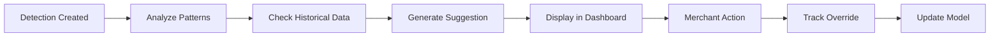
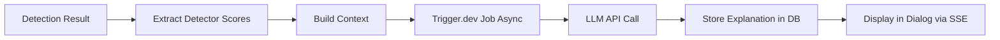

# Epic 4: Système de Décisions Assisté par IA

**Status**: 📋 Pending Technical Validation  
**Timeline**: Post-MVP (Sprint 6-7, 10 jours ouvrés)  
**Stories**: 4 stories  
**Story Points**: ~34 points (estimation)

---

## Epic Goal

Implémenter un système de décisions assisté par IA qui aide les marchands à prendre des décisions éclairées sur les transactions frauduleuses. L'epic inclut des suggestions IA pour whitelist/blacklist basées sur l'analyse des patterns, des explications IA des décisions de fraude en langage naturel, des recommandations de règles custom personnalisées, et un feedback loop qui permet à l'IA d'apprendre des overrides manuels des marchands. À l'issue de cet epic, les marchands bénéficient d'une assistance intelligente qui réduit les faux positifs, améliore la confiance dans les décisions, et personnalise la protection selon leur contexte business.

---

## Success Criteria

- ✅ Suggestions IA pour whitelist/blacklist affichées dans le dashboard avec confiance score
- ✅ Explications IA des décisions de fraude générées en langage naturel (français)
- ✅ Recommandations de règles custom personnalisées basées sur l'historique du marchand
- ✅ Feedback loop fonctionnel : overrides manuels trackés et utilisés pour améliorer suggestions
- ✅ Interface utilisateur intuitive pour accepter/rejeter suggestions IA
- ✅ Performance : génération explications <2s (async), suggestions <500ms
- ✅ Taux d'acceptation suggestions IA ≥60% (mesure de qualité)

---

## Stories

### Story 4.1: Suggestions IA pour Whitelist/Blacklist
**Description**: Système IA qui suggère automatiquement whitelist/blacklist basé sur patterns historiques  
**Story Points**: 8  
**Status**: 📋 Ready

### Story 4.2: Explications IA des Décisions de Fraude
**Description**: Génération d'explications en langage naturel expliquant pourquoi une transaction est bloquée  
**Story Points**: 8  
**Status**: 📋 Ready

### Story 4.3: Recommandations de Règles Custom Personnalisées
**Description**: IA suggère des règles custom optimales basées sur l'historique et le contexte business  
**Story Points**: 8  
**Status**: 📋 Ready

### Story 4.4: Feedback Loop & Apprentissage des Overrides
**Description**: Système qui track les overrides manuels et améliore les suggestions futures  
**Story Points**: 10  
**Status**: 📋 Ready

---

## Technical Dependencies

### Pre-Requisites
- ✅ Epic 1 completed (Detection API functional avec detectors)
- ✅ Epic 2 completed (Dashboard avec actions block/whitelist)
- ✅ Epic 3 completed (Production ready, observability stack)
- ✅ Base de données avec historique transactions et actions marchands

### External Services Required
- 🔧 LLM API (OpenAI GPT-4 ou Anthropic Claude) pour génération explications
- 🔧 Trigger.dev v4 pour traitement async (ADR-006) - déjà décidé
- 🔧 Service de stockage pour embeddings/patterns (optionnel pour v1)

### Infrastructure
- 🔧 Environment variables: `OPENAI_API_KEY` ou `ANTHROPIC_API_KEY`
- 🔧 Trigger.dev configuré (ADR-006) : `TRIGGER_SECRET_KEY`, `TRIGGER_API_URL`
- 🔧 Rate limiting configuré pour API LLM
- 🔧 Cache Redis pour suggestions (éviter appels répétés)

---

## Architecture Notes

### Flow de Suggestions IA



### Flow d'Explications IA



### Architecture de Feedback Loop

```typescript
interface AIFeedback {
  suggestionId: string;
  merchantAction: 'accepted' | 'rejected' | 'modified';
  merchantReason?: string;
  timestamp: Date;
  context: DetectionContext;
}

// Track feedback pour améliorer suggestions futures
async function trackFeedback(feedback: AIFeedback) {
  await db.insert(aiFeedback).values(feedback);
  // Trigger model update job (async)
}
```

### Structure de Données

**Table `ai_suggestions`**:
- `id`, `detectionId`, `type` (whitelist/blacklist/rule), `confidence` (0-1)
- `suggestion` (JSON), `accepted` (boolean), `merchantAction` (string)
- `createdAt`, `updatedAt`

**Table `ai_explanations`**:
- `id`, `detectionId`, `explanation` (text), `generatedAt`
- `model` (gpt-4o-mini/claude), `tokensUsed`, `latency`, `triggerJobId`

**Table `ai_feedback`**:
- `id`, `suggestionId`, `merchantAction`, `merchantReason`
- `context` (JSON), `createdAt`

---

## Performance Requirements

| Metric | Target | Critical? |
|--------|--------|-----------|
| **Suggestion Generation** | <500ms | ✅ Yes |
| **Explanation Generation** | <2s (async) | ⚠️ Nice-to-have |
| **LLM API Latency** | <3s P95 | ⚠️ Nice-to-have |
| **Cache Hit Rate (Suggestions)** | >70% | ⚠️ Nice-to-have |
| **Dashboard Load (with suggestions)** | <2.5s | ✅ Yes |

---

## Testing Strategy

### Unit Tests
- Suggestion generation logic
- Explanation formatting
- Feedback tracking
- Pattern analysis algorithms

### Integration Tests
- LLM API integration (mocked)
- Database operations (suggestions, feedback)
- Cache invalidation logic

### E2E Tests
- Merchant accepte suggestion whitelist → vérifier action appliquée
- Merchant rejette suggestion → vérifier feedback tracké
- Explication IA affichée dans dialog détection

---

## Risk Management

### High Priority Risks

**Risk 1**: Coût API LLM trop élevé à grande échelle
- **Mitigation**: Cache agressif, génération async uniquement (Trigger.dev), rate limiting, modèle GPT-4o-mini (moins cher)
- **Contingency**: Fallback vers explications template-based si budget dépassé (>€200/mois)

**Risk 2**: Qualité explications IA insuffisante (hallucinations)
- **Mitigation**: Prompt engineering rigoureux, validation humaine, fallback templates
- **Contingency**: Mode "explications simples" (détecteurs + scores) si LLM non fiable

**Risk 3**: Suggestions IA trop conservatrices ou trop agressives
- **Mitigation**: Ajustement seuils confiance, A/B testing, feedback continu
- **Contingency**: Désactivation suggestions si taux acceptation <40%

**Risk 4**: Latence explications IA impacte UX
- **Mitigation**: Génération async, affichage progressif (skeleton → explanation)
- **Contingency**: Explications optionnelles (toggle on/off)

---

## Definition of Done (Epic Level)

- [ ] All 4 stories completed with AC met
- [ ] Suggestions IA affichées dans dashboard avec confiance score
- [ ] Explications IA générées et affichées dans dialog détection
- [ ] Recommandations règles custom fonctionnelles
- [ ] Feedback loop tracke overrides et améliore suggestions
- [ ] Performance validée: suggestions <500ms, explications <2s async
- [ ] Tests passent (unit + integration + E2E)
- [ ] Documentation API LLM et prompts (Trigger.dev jobs)
- [ ] Trigger.dev dashboard configuré pour monitoring
- [ ] Code reviewed and merged to main
- [ ] Deployed to production avec feature flag

---

## Success Metrics (Post-Launch)

| Metric | Target | Tracking |
|--------|--------|----------|
| **Taux Acceptation Suggestions** | ≥60% | PostHog event `ai_suggestion_accepted` |
| **Temps Moyen Décision Marchand** | -30% | PostHog event `merchant_action_time` |
| **Faux Positifs Réduits** | -20% | Comparaison avant/après suggestions |
| **Satisfaction Explications IA** | 4/5 | Survey beta users |
| **Coût API LLM/mois** | <€200 | Monitoring usage |

---

## Future Enhancements (Post-Epic 4)

- **Modèle d'apprentissage à 3 niveaux** (Global/Industrie/Local) - Moonshot
- **Explications IA en temps réel** (streaming)
- **Suggestions IA pour bulk actions** (plusieurs transactions)
- **Personnalisation avancée** (apprentissage par marchand individuel)
- **Multi-langue** (explications en anglais, espagnol, etc.)

---

## Next Epic

**Epic 5**: Customer Management Interface (Sprint 8-9)  
Depends on: Epic 4 completion (IA suggestions fonctionnelles)

---

**Created**: 2026-01-26  
**Owner**: Product Owner (Sarah)  
**Last Updated**: 2026-01-26
