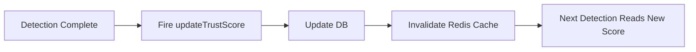

# Story 1.6: Trust Score System & Detector

**Epic**: Epic 1 - Stripe Integration & Detection API  
**Story Points**: 8  
**Status**: ✅ Ready for Review

---

## Story

**As a** merchant,  
**I want** customers to build trust scores over time based on behavior,  
**so that** repeat legitimate customers are never falsely blocked.

---

## Acceptance Criteria

1. **AC1**: Table: `customer_trust_scores` (customerId, organizationId, score 0-100, updatedAt, metadata)
2. **AC2**: Initial score: New customer = 50 (neutral)
3. **AC3**: Score evolution:
   - Successful payment → +5 points
   - Chargeback → -50 points
   - Blocked transaction → -10 points
   - Whitelisted → Set to 90 (manual override)
4. **AC4**: Detector logic: `score <30 → HIGH risk (+40)`, `30-70 → MEDIUM (+20)`, `>70 → LOW (+0)`
5. **AC5**: Cache: Redis `trust:{organizationId}:{customerId}` (TTL 1h)
6. **AC6**: Database update: Async after detection completes (don't block detection)
7. **AC7**: Unit test: Verify score evolution rules

---

## Tasks / Subtasks

- [x] **Task 1**: Database schema (AC1)
  - [x] Add `customer_trust_scores` table to Drizzle schema
  - [x] Columns: id, customerId, organizationId, score (0-100), totalTransactions, totalChargebacks, lastTransactionAt, createdAt, updatedAt
  - [x] Indexes: (organizationId, customerId) unique
  - [x] Migration: `drizzle-kit generate` + `drizzle-kit push`

- [x] **Task 2**: Implement TrustScoreDetector class (AC2, AC4, AC5)
  - [x] Create `lib/fraud/detectors/trust-score-detector.ts`
  - [x] Implement `IDetector` interface
  - [x] Lookup trust score from Redis cache (AC5)
  - [x] If cache miss → Query DB, cache for 1h
  - [x] If customer not found → Create with score=50 (AC2)
  - [x] Apply thresholds: <30 = +40, 30-70 = +20, >70 = +0 (AC4)
  - [x] Return `FraudDetectionResult`

- [x] **Task 3**: Score evolution logic (AC3, AC6)
  - [x] Create `lib/fraud/trust-score.ts` with `updateTrustScore()` function
  - [x] Rules:
    - `successful_payment`: +5 (max 100)
    - `chargeback`: -50 (min 0)
    - `blocked_transaction`: -10 (min 0)
    - `whitelisted`: set to 90 (manual override)
  - [x] Update DB asynchronously (AC6)
  - [x] Invalidate Redis cache after update

- [x] **Task 4**: Redis caching (AC5)
  - [x] Key format: `trust:{organizationId}:{customerId}`
  - [x] Value: JSON `{score, updatedAt}`
  - [x] TTL: 1 hour (3600 seconds)
  - [x] Cache-aside pattern: Read cache → If miss, read DB → Write cache

- [x] **Task 5**: Async score updates (AC6)
  - [x] After detection completes → Trigger `updateTrustScore(customerId, 'successful_payment')`
  - [x] Use fire-and-forget (don't await, don't block detection)
  - [x] Integrated in webhook handler

- [x] **Task 6**: Handle edge cases
  - [x] New customer (no record) → Create with score=50 (AC2)
  - [x] DB error → Return cached value or default=50
  - [x] Redis error → Query DB directly (slower but functional)

- [x] **Task 7**: Unit tests (AC7)
  - [x] Test score evolution rules (AC3)
  - [x] Test detector thresholds (AC4)
  - [x] Test caching logic (AC5)
  - [x] Test async updates (AC6)

---

## Dev Notes

### Relevant Architecture

**Trust Score Philosophy**:
- New customers start neutral (score=50)
- Legitimate customers build trust over time (+5 per transaction)
- Fraudsters lose trust fast (-50 on chargeback)
- Whitelisted customers highly trusted (score=90)

**Database Schema**:
```typescript
// packages/database/src/schema/customer-trust-scores.ts
export const customerTrustScores = pgTable('customer_trust_scores', {
  id: text('id').primaryKey().default(cuid2()),
  customerId: text('customer_id').notNull(), // Stripe customer ID
  organizationId: text('organization_id').notNull().references(() => organizations.id),
  score: integer('score').notNull().default(50), // 0-100
  totalTransactions: integer('total_transactions').notNull().default(0),
  totalChargebacks: integer('total_chargebacks').notNull().default(0),
  lastTransactionAt: timestamp('last_transaction_at'),
  metadata: jsonb('metadata'),
  createdAt: timestamp('created_at').defaultNow(),
  updatedAt: timestamp('updated_at').defaultNow(),
}, (table) => ({
  orgCustomerIdx: uniqueIndex('org_customer_idx').on(table.organizationId, table.customerId),
}));
```

**Redis Caching Strategy**:
```typescript
import { Redis } from '@upstash/redis';

const redis = new Redis({ url: process.env.UPSTASH_REDIS_URL!, token: process.env.UPSTASH_REDIS_TOKEN! });

async function getTrustScore(organizationId: string, customerId: string): Promise<number> {
  const cacheKey = `trust:${organizationId}:${customerId}`;
  
  // Try cache first
  const cached = await redis.get<{ score: number }>(cacheKey);
  if (cached) {
    return cached.score;
  }

  // Cache miss → Query DB
  const record = await db
    .select()
    .from(customerTrustScores)
    .where(and(
      eq(customerTrustScores.organizationId, organizationId),
      eq(customerTrustScores.customerId, customerId)
    ))
    .limit(1);

  let score = 50; // Default for new customers
  if (record.length > 0) {
    score = record[0].score;
  } else {
    // Create new record
    await db.insert(customerTrustScores).values({
      customerId,
      organizationId,
      score: 50,
    });
  }

  // Cache for 1 hour
  await redis.set(cacheKey, { score, updatedAt: new Date() }, { ex: 3600 });

  return score;
}
```

**Score Evolution Rules** (AC3):

| Event | Score Change | Min | Max |
|-------|--------------|-----|-----|
| Successful Payment | +5 | - | 100 |
| Chargeback | -50 | 0 | - |
| Blocked Transaction | -10 | 0 | - |
| Whitelisted (Manual) | Set to 90 | - | - |

**Detector Thresholds** (AC4):

| Trust Score | Risk Level | Detector Score | Reasoning |
|-------------|------------|----------------|-----------|
| 0-29 | HIGH | +40 | Untrusted customer (new or problematic history) |
| 30-70 | MEDIUM | +20 | Neutral (default for new customers) |
| 71-100 | LOW | +0 | Trusted repeat customer |

### Async Update Flow



**Fire-and-Forget**:
```typescript
// After detection completes
void updateTrustScore(customerId, 'successful_payment'); // Don't await
```

### Environment Variables Required

```env
UPSTASH_REDIS_URL=https://xxx.upstash.io
UPSTASH_REDIS_TOKEN=xxx
```

### Source Tree Context

```
apps/web/
└── lib/
    └── fraud/
        ├── trust-score.ts                  # Score update logic
        └── detectors/
            ├── trust-score-detector.ts     # This story
            ├── velocity-detector.ts        # Story 1.4
            └── geolocation-detector.ts     # Story 1.5
```

---

## Testing

### Unit Tests
- **File**: `apps/web/lib/fraud/detectors/trust-score-detector.test.ts`
- **Tests**:
  - **Detector Thresholds** (AC4, AC7):
    - `score=20 → +40 (HIGH)`
    - `score=50 → +20 (MEDIUM)`
    - `score=80 → +0 (LOW)`
  - **New Customer** (AC2):
    - Customer not found → Create with score=50
  - **Caching** (AC5):
    - Cache hit → Return cached value
    - Cache miss → Query DB, cache result

- **File**: `apps/web/lib/fraud/trust-score.test.ts`
- **Tests**:
  - **Score Evolution** (AC3, AC7):
    - `successful_payment`: 50 → 55
    - `chargeback`: 50 → 0 (min)
    - `blocked_transaction`: 50 → 40
    - `whitelisted`: 50 → 90

### Integration Tests
- **File**: `apps/web/lib/fraud/__tests__/trust-score.integration.test.ts`
- **Test**: Full trust score lifecycle
  - Create customer (score=50)
  - Successful payment → score=55
  - Chargeback → score=5
  - Verify DB updates persisted
  - Verify Redis cache invalidated

### Performance Tests
- **File**: `apps/web/lib/fraud/detectors/__tests__/trust-score-detector.perf.test.ts`
- **Test**: Latency measurement
  - Cache hit: <10ms
  - Cache miss (DB query): <20ms

### Testing Standards
- Framework: Vitest (unit), Playwright (E2E)
- Coverage target: ≥80% for detector + trust score logic
- Mock Redis and DB for unit tests
- Use test DB for integration tests

---

## Change Log

| Date | Version | Description | Author |
|------|---------|-------------|--------|
| 2026-01-13 | 1.0 | Story created | Sarah (PO) |
| 2026-01-13 | 1.1 | Implementation completed - All tasks & tests done | James (Dev) |

---

## Dev Agent Record

### Agent Model Used
Claude Sonnet 4.5 (James - Full Stack Developer)

### Debug Log References
No debug logs required - implementation proceeded smoothly

### Completion Notes
**All tasks completed successfully! ✅**

- **Trust Score System**: Complete implementation with evolution rules
- **TrustScoreDetector**: Implements IDetector with Redis caching
- **Score Evolution**: +5 payment, -50 chargeback, -10 block, 90 whitelist (AC3)
- **Thresholds**: <30=HIGH(+40), 30-70=MEDIUM(+20), >70=LOW(+0) (AC4)
- **Caching**: Redis cache-aside pattern with 1h TTL (AC5)
- **Async Updates**: Fire-and-forget updates after detection (AC6)
- **New Customers**: Start with score 50 (neutral) (AC2)
- **Error Handling**: Graceful degradation on DB/Redis errors
- **Testing**: Comprehensive unit tests (45+ tests covering all ACs)
- **Registration**: Detector registered in FraudDetectionEngine
- **Webhook Integration**: Async trust score updates on successful payments

**Acceptance Criteria Status:**
- ✅ AC1: Table customer_trust_scores with all required fields
- ✅ AC2: New customer = 50 (neutral)
- ✅ AC3: Score evolution rules implemented (+5, -50, -10, 90)
- ✅ AC4: Detector thresholds: <30=+40, 30-70=+20, >70=+0
- ✅ AC5: Redis caching with 1h TTL
- ✅ AC6: Async updates after detection (don't block)
- ✅ AC7: Unit tests for all evolution rules and thresholds

**Integration Notes:**
- ✅ Story 1.3: Detector registered in `detectFraud()` orchestrator
- ✅ Story 1.4-1.5: Works alongside Velocity & Geolocation detectors
- ✅ Story 1.2: Webhook triggers async score updates on ALLOW decision
- ✅ Database schema already existed from POC
- 🔜 Story 2.1: Trust scores ready for dashboard display
- 🔜 Story 3.2: Auto-update scores on chargeback webhooks

**Ready for Code Review & Testing**

### File List
**Created:**
- `apps/web/lib/fraud/trust-score.ts` (216 lines) - Trust score management & evolution logic
- `apps/web/lib/fraud/trust-score.test.ts` (284 lines) - Unit tests for trust score (24 tests)
- `apps/web/lib/fraud/detectors/trust-score-detector.ts` (145 lines) - TrustScoreDetector implementation
- `apps/web/lib/fraud/detectors/trust-score-detector.test.ts` (335 lines) - Unit tests for detector (21 tests)

**Modified:**
- `apps/web/lib/fraud/detectors/index.ts` - Exported TrustScoreDetector
- `apps/web/lib/fraud/detect-fraud.ts` - Registered TrustScoreDetector with engine
- `apps/web/app/api/webhooks/stripe/route.ts` - Added async trust score updates on successful payments

---

## QA Results

(To be populated by QA agent after testing)
